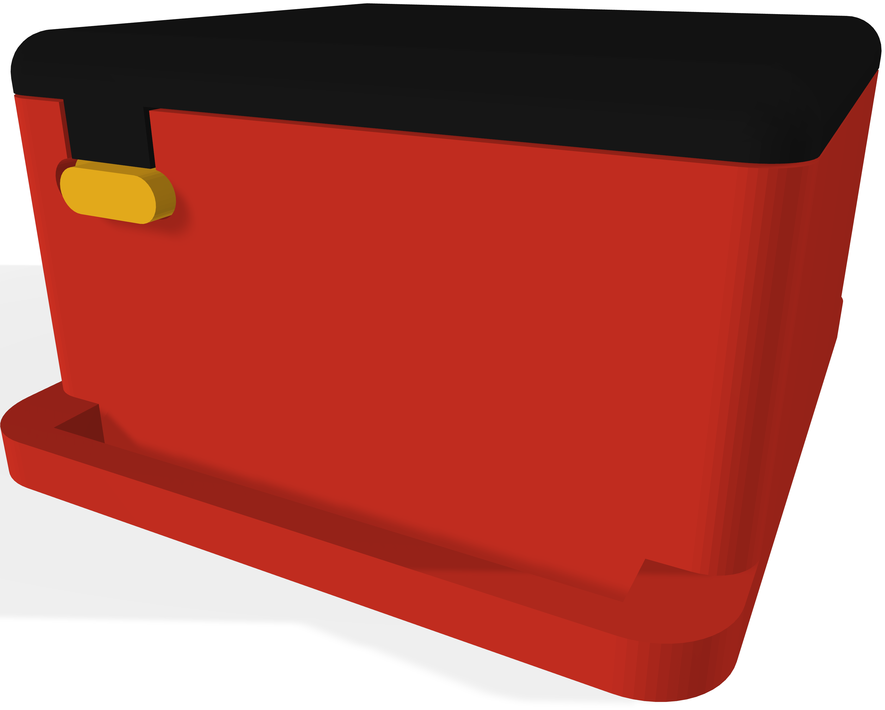

# **Zaku²** Case for DIY SlimeVR

## The Zaku² case is one of the smallest cases desgined for DIY SlimeVR

All the parts were designed with FDM 3D-Printing in mind, without requiring any printing supports.
The case has a snap fitting lid design that snaps into place without the need of any screws or adhesive.
The case currently supports two types of batteries, and a single IMU type at the moment.
(Support for different IMUs and extensions is in the works)

## Index

- [Components](#Components)
- [Versions](#Versions)
- [Assembly](#Assembly)
- [Contact](#Contact)
- [License (MIT)](#License)

## Components

- TP4056 ( Type-C )

- Wemos D1 Mini

- IMU

   - MPU6050
  
- Battery
  
  - 804040 Battery

  - Nokia BP-5M Battery

- Switches

   - SS12D00G3

- Straps

   - 40mm Elastic Straps

## Versions 

- 804040 Battery

- BP-5M Nokia Battery

## Assembly

The IMU will be mounted over the battery, which could cause shorts. It's recommended to put a piece of electric tape over the part of the battery that is under the IMU, or use liquid electrical tape to insulate the battery from the IMU. The tray also has a modular design that allowes wires to be routed either under, or over the tray with cutouts to allow easy access to all the components.

## Contact

If you experience any problems or have questions/suggestions, feel free to contact me through the offical SlimeVR Discord I'm @Tom Yum#0069. If you want to help out with the project or want to make a version for a different set of hardware, you're more than welcome to send it over or do a merge request!

## License

This project is licensed under the MIT license.
